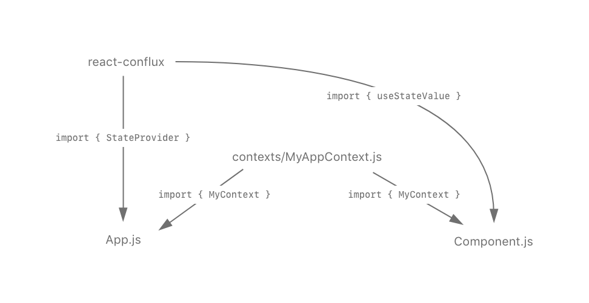

🚧 **This is a very rough proof-of-concept.**

### Re-imagining the `react-conflux` API

[`react-conflux`](https://github.com/dustinmyers/react-conflux) is a nice, lightweight state management library for React applications. I wanted to try to explore a possibility for the API that would reduce some of the boilerplate even further while maintaining the minimalism and simplicity of the library. To show by example the difference in the proposed API, this is from the counter app example from the `react-conflux` repo:

```js
// App.js
import React from "react"
import { StateProvider } from "react-conflux"
import { counterReducer } from "store/reducers/counterReducer"
import { titleReducer } from "store/reducers/titleReducer"
import { CounterContext, TitleContext } from "store/contexts"

import Counter from "./components/Counter"

const App = () => {
  return (
    <StateProvider reducer={counterReducer} StateContext={CounterContext}>
      <StateProvider reducer={titleReducer} StateContext={TitleContext}>
        <Counter />
      </StateProvider>
    </StateProvider>
  )
}

export default App
```

With the re-imagined API this might be:

```js
import React from "react"
import makeStateContext from "react-conflux"
import { counterReducer } from "store/reducers/counterReducer"
import { titleReducer } from "store/reducers/titleReducer"

import Counter from "components/Counter"

const [CounterProvider, useCounterValue] = makeStateContext(counterReducer)
const [TitleProvider, useTitleValue] = makeStateContext(titleReducer)
export { useCounterValue, useTitleValue }

const App = () => {
  return (
    <CounterProvider>
      <TitleProvider>
        <Counter />
      </TitleProvider>
    </CounterProvider>
  )
}

export default App
```

<details>
<summary>The diff</summary>

```diff
  import React from 'react';
- import { StateProvider } from 'react-conflux';
+ import makeStateContext from 'react-conflux';
  import { counterReducer } from 'store/reducers/counterReducer';
  import { titleReducer } from 'store/reducers/titleReducer';
- import { CounterContext, TitleContext } from 'store/contexts';

  import Counter from 'components/Counter';

+ const [CounterProvider, useCounterValue] = makeStateContext(counterReducer);
+ const [TitleProvider, useTitleValue] = makeStateContext(titleReducer);
+ export { useCounterValue, useTitleValue };

  const App = () => {
    return (
-     <StateProvider reducer={counterReducer} StateContext={CounterContext}>
-       <StateProvider reducer={titleReducer} StateContext={TitleContext}>
+     <CounterProvider>
+       <TitleProvider>
          <Counter />
-       </StateProvider>
-     </StateProvider>
+       </TitleProvider>
+     </CounterProvider>
    );
  };

  export default App;
```

</details>
<br/>

At the `App.js` level, the reduction in boilerplate isn't immediately obvious, in fact it adds a total of two lines. The benefit though is that there is no need to create your own contexts as you would with the former example; the `store/contexts` directory and user calls to `React.createContext` can be completely extracted and taken care of by the library code.

There is also no need to import the context instance at any consumer components, as that's already captured in `useCounterValue` for example.

To visualize the difference in terms of dependencies between files, the original API might play out like so

The reimagined API dependencies might look like


### Todo:

- I'm not sure what the implications are for performance, haven't tested this beyond the super-simple app found in this repo
